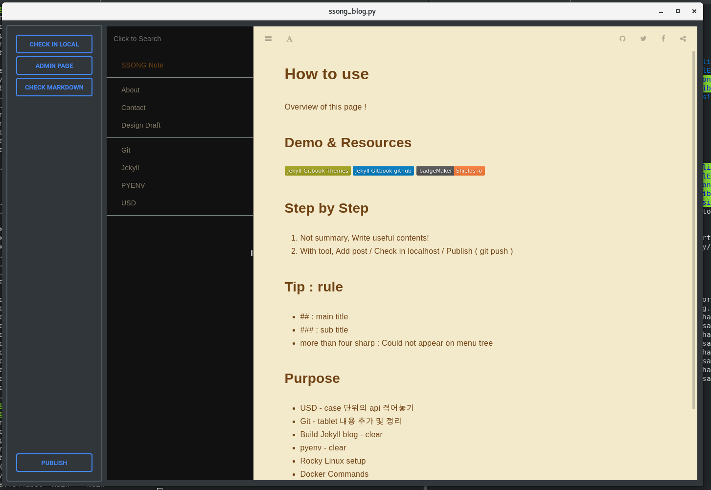

# JekyllEditor
---

### requirements
- need to setup jekyll blog and run as a localhost

### features
- swtich three web pages to edit jekyll blog easily
    - Rendered Jekyll blog page
    - Admin page : edit Jekyll blog post
    - Markdown rendering page : check markdown grammar

### Demo - [Video link](https://youtu.be/YbaKs7QbOqo)

